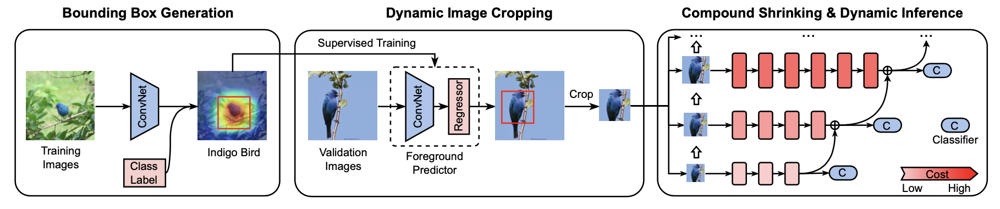

# EdgeCompress: Coupling Multi-Dimenional Model Compression and Dynamic Inference for EdgeAI

This repository is provided for reproducing the experimental results reported in the above paper submitted to **IEEE Transactions on Computer Aided Design of Integrated Circuits and Systems (TCAD)**.

## Overview of The Proposed Framework

### 1. The overall framework



### 2. The dynamic inference framework


## Environment

* Python: 3.7.10
* Pytorch: 1.7.0
* Numpy: 1.20.2
* CUDA: 11.2
* Yacs: 0.1.8
* Pillow: 8.2.0
* Hardware: RTX-3090

## Preparing Your Data

To reproduce the results reported in the paper, you need to get the datasets ready first.

**ImageNet-1K:**

* Official Introduction 
    >ImageNet is an image database organized according to the WordNet hierarchy (currently only the nouns), in which each node of the hierarchy is depicted by hundreds and thousands of images. The project has been instrumental in advancing computer vision and deep learning research. The data is available for free to researchers for non-commercial use.

1. Download the ImageNet-1K validation set via this [LINK](https://image-net.org/download.php)

2. Extract images using the following command:
   ```
   mkdir val && tar -xvf ILSVRC2012_img_val.tar -C ./val
   ```
   
3. Copy prepare_validation.sh to the val directory and re-organize the validation images with:
   ```
   bash prepare_validation.sh
   ```
   
4. If everything goes right, your dataset should be organized as follows:
   ```
   -- dataset 
   -- val
      --n01440764
         --ILSVRC2012_val_00000293.JPEG
         --ILSVRC2012_val_00002138.JPEG
         --...
      --n01443537
      --...
   ```


## Pretrained Models

Here we provide the pretrained model weights of our approach for reproducing the experimental results reported in the paper.

| Model | MACs (G) | Top-1 Acc. (%) | Configuration | Weights |
| ------ | ------ | ------ | ------ | ------ |
| Resnet50 (Baseline) | 4.1 | 76.0 | `configs/resnet50.yaml` | [Pretrained](https://www.google.com)
| EC-Static-1 | 1.2 | 73.9 | `configs/ec-static-1.yaml` | [Pretrained](https://drive.google.com/file/d/1PqWKOPH0jEEVnHFhsn5Hv7SV1Dnq5ho_/view?usp=share_link)
| EC-Static-2 | 1.3 | 74.2 | `configs/ec-static-2.yaml` | [Pretrained](https://drive.google.com/file/d/19Gm_ek6OO7HrQ6PJ5q9Uqh99AjmUb9el/view?usp=share_link)
| EC-Static-3 | 1.8 | 75.6 | `configs/ec-static-3.yaml` | [Pretrained](https://drive.google.com/file/d/1_hrdGV4ZZzHUAwLtFRc94e8ZuOodIUQ2/view?usp=share_link)
| EC-Static-4 | 2.4 | 76.3 | `configs/ec-static-4.yaml` | [Pretrained](https://drive.google.com/file/d/1g2_t4zCIpcvbT49FjAaaYmjtQgg-zOyV/view?usp=share_link)
| EC-Static-5 | 3.2 | 76.8 | `configs/ec-static-5.yaml` | [Pretrained](https://drive.google.com/file/d/17ZYzdjJBlFt8rP1DdOBoj1rib1RzzbAc/view?usp=share_link)
| EC-Static-6 | 4.2 | 77.2 | `configs/ec-static-6.yaml` | [Pretrained](https://drive.google.com/file/d/1LKG3r_-QEY-_GVZTiPiu0lgfKvlWLCUu/view?usp=share_link)


## Evaluation

In this section, we will demonstrate how to utilize the provided pretrained weights to reproduce the results reported in the paper.

### Static inference
For instance, to evaluate the **EC-Static-1** model, using the following command: 

```
python3 main.py -m crop_eval -c configs/ec-static-1.yaml
                MODEL.WEIGHTS path/to/the/downloaded/ec-static-1/weights
                DATASET.PATH path/to/imagenet/dataset
```

If everything goes right, you will obtain the following output:

```
[meters.py: 464]: json_stats: {"_type": "test_epoch", "epoch": "1/100", "max_top1_acc": 73.8660, "max_top5_acc": 91.6160, "mem": 1650, "time_avg": 0.0679, "time_epoch": 13.3026, "top1_acc": 73.8660, "top5_acc": 91.6160}
```

To evaluate other static models, you just need to change to configuration file and the path to the corresponding pretrained weights.

### Dynamic inference
To evaluate our dynamic inference framework, using the following command:

```
python3 main.py -m dy_eval -c configs/ec-dynamic.yaml
                DATASET.PATH path/to/imagenet/dataset
                DYNAMIC.THRESHOLD_HIGH 0.2
```

and you will obtain an output as follows:

```
[meters.py: 464]: json_stats: {"_type": "test_epoch", "epoch": "1/100", "max_top1_acc": 76.8380, "max_top5_acc": 92.9460, "mem": 2919, "time_avg": 0.1148, "time_epoch": 44.8804, "top1_acc": 76.8380, "top5_acc": 92.9460}
```

The trade-off between model MACs and accuracy of our dynamic inference framework is controled by the hyperparameter **DYNAMIC.THRESHOLD_HIGH**. If you want to acheive higher accuracy at the cost higher model MACs, just increase the value. Otherwise, you can tune down the value of the hyperparameter to improve the model execution efficiency.

### Parallel processing with multiple GPUs
It's worth noting that all models support parallel processing by specifying the execution hyperparameter **NUM_GPUS**.

For example, to evaluate the **EC-Static-1** model with 4 GPUs, you just need to slightly adjust the execution command as follows:

```
python3 main.py -m crop_eval -c configs/ec-static-1.yaml
                MODEL.WEIGHTS path/to/the/downloaded/ec-static-1/weights
                DATASET.PATH path/to/imagenet/dataset
                NUM_GPUS 4
```
and then you can easily accelerate the evaluation process.
